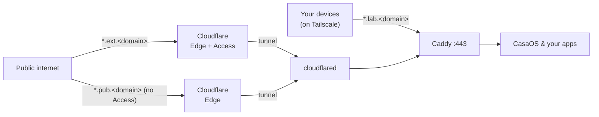

# homelab

Reach self-hosted services by name instead of `IP:port`, running alongside an existing
[CasaOS](https://casaos.io/) install. One reverse proxy ([Caddy](https://caddyserver.com/))
is the only front door:

- **Private** — over [Tailscale](https://tailscale.com/) at `*.lab.<domain>`.
- **Public, gated** — a chosen subset via [Cloudflare Tunnel + Access](https://developers.cloudflare.com/cloudflare-one/) at `*.ext.<domain>`.
- **Public, open** — no authentication, anyone on the internet, at `*.pub.<domain>`.

Config-as-code and safe to publish: everything committed is a generic template; the real
domain, service list, and secrets live only in gitignored files.



## Quick start

```
cp .env.example .env          # fill in DOMAIN + Cloudflare tokens
docker compose up -d --build
cp examples/caddy/private-service.caddy caddy/conf.d/sonarr.caddy
docker compose exec caddy caddy reload --config /etc/caddy/Caddyfile
```

Full walkthrough in [docs/setup.md](docs/setup.md). How it works in
[docs/architecture.md](docs/architecture.md). The public tiers (`*.ext`, `*.pub`) need a
Cloudflare edge certificate for their two-level names — see [docs/tls.md](docs/tls.md)
(Advanced Certificate Manager, ~$10/mo, or a free single-level alternative).

## Configuration

Every service-specific value lives in a gitignored file you create by copying an example.
Nothing below is committed.

### `.env` — domain and secrets

`cp .env.example .env`

| Key | Purpose | Where to get it |
|---|---|---|
| `DOMAIN` | your domain, managed in Cloudflare | — |
| `CLOUDFLARE_API_TOKEN` | DNS-01 wildcard certificate issuance | Cloudflare → My Profile → API Tokens, scoped **Zone → DNS → Edit** |
| `TUNNEL_TOKEN` | connects the remote-managed tunnel | Cloudflare Zero Trust → Networks → Tunnels |

### `caddy/conf.d/<service>.caddy` — one file per service

Copy the example that matches how the service should be reached, then edit the hostname
prefix and `host.docker.internal:<port>`. `{$DOMAIN}` is filled from `.env`.

| Example | Reached at | Access |
|---|---|---|
| `examples/caddy/private-service.caddy` | `*.lab.<domain>` | tailnet only |
| `examples/caddy/public-service.caddy` | `*.ext.<domain>` | public, behind Cloudflare Access |
| `examples/caddy/fully-public-service.caddy` | `*.pub.<domain>` | public, **no authentication** |
| `examples/caddy/casaos-dashboard.caddy` | `*.lab.<domain>` | the CasaOS UI on host port 80 |

```
cp examples/caddy/private-service.caddy caddy/conf.d/sonarr.caddy
docker compose exec caddy caddy reload --config /etc/caddy/Caddyfile
```

### `cloudflared/config.yml` — only for a locally-managed tunnel

The default stack uses `TUNNEL_TOKEN` (remote-managed) and does not read this file. To
manage ingress locally instead, `cp cloudflared/config.example.yml cloudflared/config.yml`,
set the tunnel id and credentials path, and change the compose command to
`tunnel --config /etc/cloudflared/config.yml run`.

### `apps/<name>/docker-compose.yml` — your own apps (optional)

For apps you run outside CasaOS. Publish a host port, then point a `conf.d` block at it.

```
cp -r examples/app apps/hello
docker compose -f apps/hello/docker-compose.yml up -d
```

Worked examples: the full-stack Excalidraw stack (live collaboration + persistent
shareable links) in [docs/excalidraw.md](docs/excalidraw.md), and the FrankMD markdown
notes app (with optional S3 image hosting) in [docs/frankmd.md](docs/frankmd.md).

## Layout

| Path | Committed | Purpose |
|---|:--:|---|
| `docker-compose.yml` | ✅ | Caddy + cloudflared stack |
| `caddy/` | ✅ | proxy image, global config, `conf.d/` glob |
| `cloudflared/config.example.yml` | ✅ | wildcard tunnel ingress template |
| `examples/` | ✅ | sample service and app configs |
| `docs/` | ✅ | architecture, setup, and TLS/gating |
| `.env` | ❌ | domain and secrets |
| `caddy/conf.d/*.caddy` | ❌ | your services (one file each) |
| `cloudflared/config.yml`, `cloudflared/*.json` | ❌ | tunnel config and credentials |
