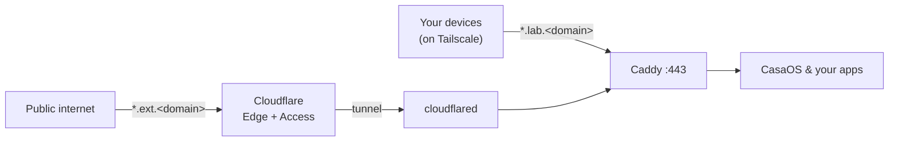

# homelab

Reach self-hosted services by name instead of `IP:port`, running alongside an existing
[CasaOS](https://casaos.io/) install. One reverse proxy ([Caddy](https://caddyserver.com/))
is the only front door:

- **Private** — over [Tailscale](https://tailscale.com/) at `*.lab.<domain>`.
- **Public** — a chosen subset via [Cloudflare Tunnel + Access](https://developers.cloudflare.com/cloudflare-one/) at `*.ext.<domain>`.

Config-as-code and safe to publish: everything committed is a generic template; the real
domain, service list, and secrets live only in gitignored files.



## Quick start

```
cp .env.example .env          # fill in DOMAIN + Cloudflare tokens
docker compose up -d --build
cp examples/caddy/private-service.caddy caddy/conf.d/sonarr.caddy
docker compose exec caddy caddy reload --config /etc/caddy/Caddyfile
```

Full walkthrough in [docs/setup.md](docs/setup.md). How it works in
[docs/architecture.md](docs/architecture.md).

## Layout

| Path | Committed | Purpose |
|---|:--:|---|
| `docker-compose.yml` | ✅ | Caddy + cloudflared stack |
| `caddy/` | ✅ | proxy image, global config, `conf.d/` glob |
| `cloudflared/config.example.yml` | ✅ | wildcard tunnel ingress template |
| `examples/` | ✅ | sample service and app configs |
| `docs/` | ✅ | architecture and setup |
| `.env` | ❌ | domain and secrets |
| `caddy/conf.d/*.caddy` | ❌ | your services (one file each) |
| `cloudflared/config.yml`, `cloudflared/*.json` | ❌ | tunnel config and credentials |
