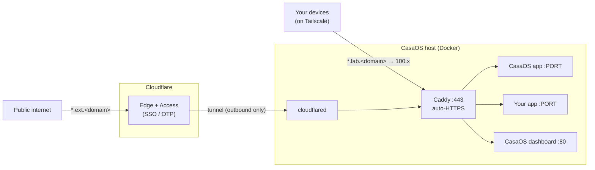

# Architecture

One reverse proxy (Caddy) is the only front door. Two paths reach it: Tailscale for
private access, a Cloudflare Tunnel for the subset you choose to expose publicly.



## Hostname spaces

| Space | Resolves to | Reachable from | Guard |
|---|---|---|---|
| `*.lab.<domain>` | Tailscale IP `100.x` (A record, DNS-only) | tailnet devices only | Tailscale membership |
| `*.ext.<domain>` | Cloudflare Tunnel (CNAME, proxied) | public internet | Cloudflare Access |

A public wildcard A-record pointing at a `100.x` address resolves for everyone but is
only *routable* from inside the tailnet — so no self-hosted DNS is needed.

## TLS

Caddy issues real Let's Encrypt certificates via the DNS-01 challenge using a scoped
Cloudflare API token. DNS-01 works even though names resolve to a private IP, and covers
the wildcard, so every new subdomain is trusted immediately. This requires a custom Caddy
build with the Cloudflare DNS module (`caddy/Dockerfile`).

## Reaching services

CasaOS apps publish ports on the host, so Caddy proxies to `host.docker.internal:<port>`
(enabled by `host-gateway` in `docker-compose.yml`). This works for containers CasaOS
launched, with no shared Docker network.

## Adding a service

Drop one file in `caddy/conf.d/` (gitignored), then reload:

```
docker compose exec caddy caddy reload --config /etc/caddy/Caddyfile
```

Use a `lab.*` hostname for private, an `ext.*` hostname for public. See `examples/caddy/`.

## Ports

CasaOS holds host port 80. Caddy binds 443 only; DNS-01 needs no port 80, so there is no
conflict. Reach the CasaOS dashboard through a `casaos.lab.<domain>` block pointing at `:80`.

## Public repo boundary

Everything committed is a generic template. Real values live only in gitignored files:

| Committed (generic) | Gitignored (your values) |
|---|---|
| `docker-compose.yml`, `caddy/`, `cloudflared/config.example.yml`, `docs/`, `examples/` | `.env`, `caddy/conf.d/*.caddy`, `cloudflared/config.yml`, `cloudflared/*.json`, `caddy_data/` |

The tunnel config uses a single wildcard ingress (`*.ext.<domain> → caddy`), so even it
names no individual service. What is public is decided only by your `ext.*` blocks.
